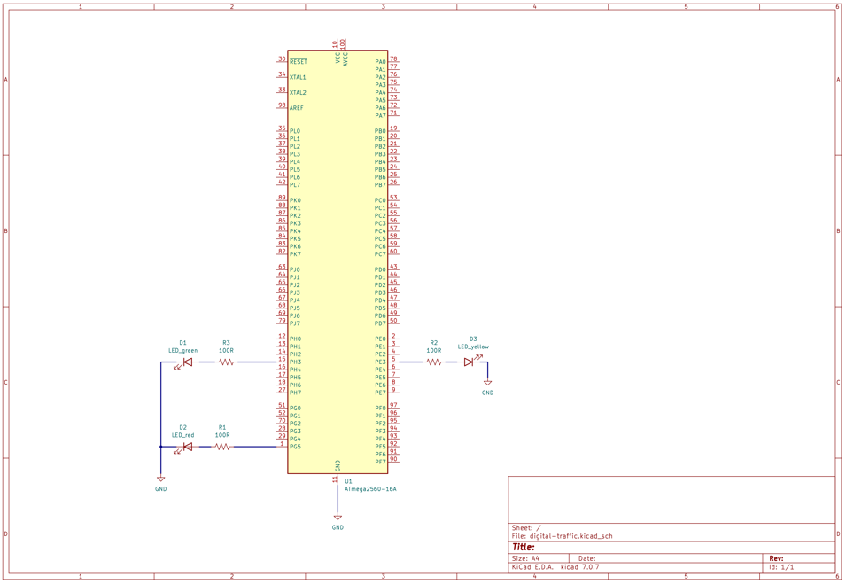
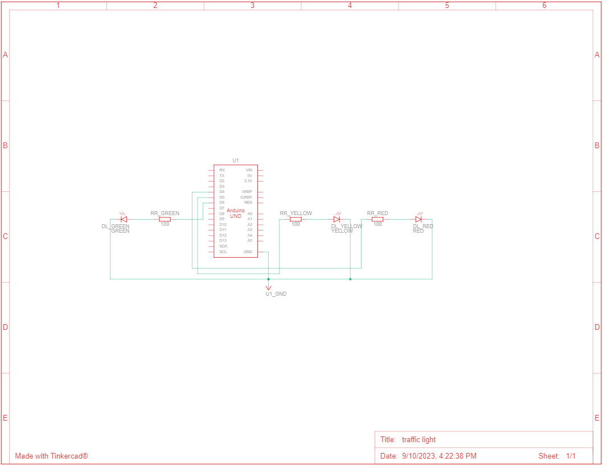
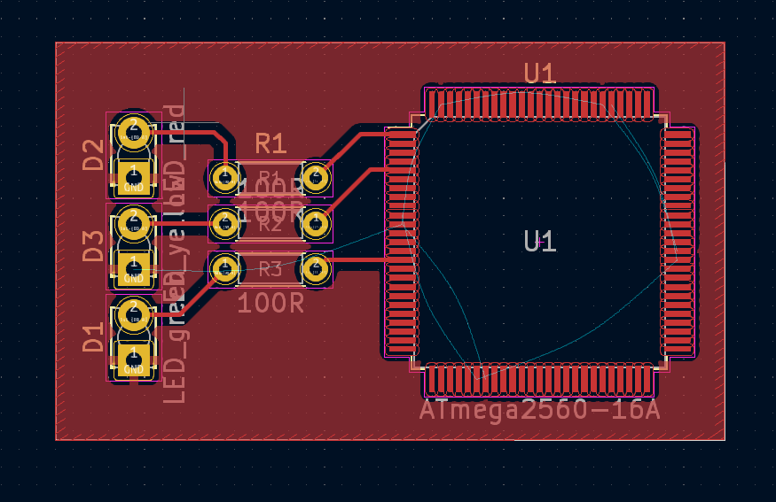
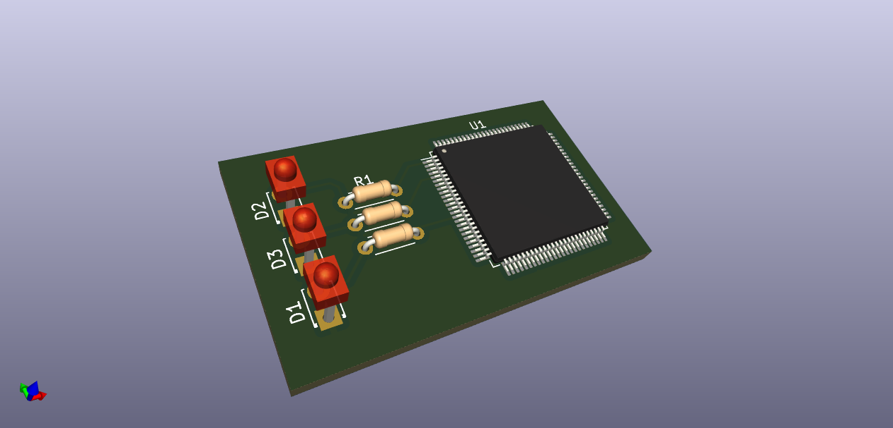
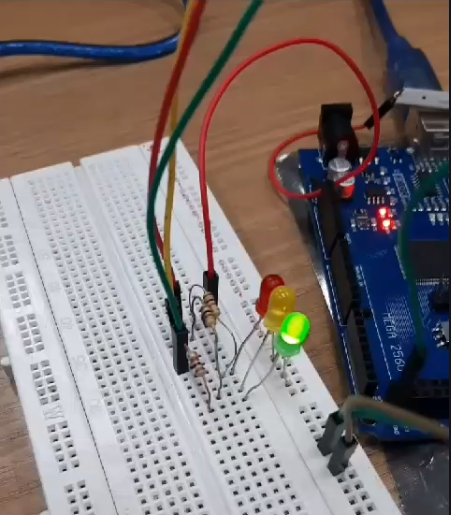
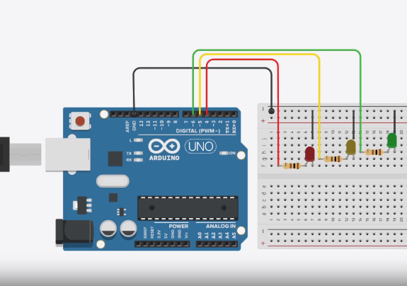

# Building a Traffic Light with Digital Systems 🚦

The objective of this project was to design a traffic light system in which the red signal lasts for 5 seconds, the amber signal lasts for 2 seconds, and the green signal lasts for 5 seconds. The focus was not only on developing the project but also on applying the knowledge acquired regarding the Arduino platform, as well as C programming, by directly manipulating the registers of the microcontroller used (ATMega2560 in practice and ATMega328p in simulations on [Tinkercad](https://www.tinkercad.com/)).

## 📦 Components List (Arduino Mega - ATMega2560)

|Name                             |Quantity  |Component                |
|---------------------------------|----------|--------------------------|
|U1                               |    1     |Arduino Mega (ATMega2560) |
|DL_red                           |    1     |Red LED                  |
|DL_amber                         |    1     |Amber LED               |
|DL_green                         |    1     |Green LED                 |
|RR_green, RR_amber, RR_red       |    3     |100 Ω Resistor         |

## 📦 Components List (Arduino Uno - ATMega328p)

|Name                             |Quantity  |Component                   |
|---------------------------------|----------|-----------------------------|
|U1                               |    1     |Arduino Uno (ATmega328p)     |
|DL_red                           |    1     |Red LED                     |
|DL_amber                         |    1     |Amber LED                   |
|DL_green                         |    1     |Green LED                   |
|RR_green, RR_amber, RR_red       |    3     |100 Ω Resistor               |

## 💡 Schematic View

|Schematic view of the project (ATMega2560)  | Schematic view of the project (Arduino Uno - ATMega) |
|---------------------------------|----------|
|  |  |

Based on the above schematics, the circuit was built, and a conceptual PCB view was produced using the [KiCad](https://www.kicad.org/) software. The model used for production was the circuit schematic using the ATMega 2560.

|KiCad PCB Editor (ATMega2560)  | 3D PCB (ATMega2560) |
|---------------------------------|----------|
|  |  |

## 💻 Simulation

### 📌 Program 1 - Direct Register Manipulation

The first program uses native Arduino commands. It utilizes the `pinMode()` and `digitalWrite()` functions to configure the pins as outputs and control the LEDs. These functions abstract the direct manipulation of registers, making the code more readable and accessible. Additionally, the `delay()` functions are used to create time delays.

### 📌 Program 2 - Using Arduino Commands

The second program employs the technique of direct register manipulation to control the traffic light LEDs. In this case, the LEDs are connected to pins 4, 5, and 6 of the Arduino, which correspond to registers DDRG, DDRE, and DDRH for ATMega2560 and the DDRD register group in the case of ATMega328p. Equivalent commands to configure the pins as outputs, turn the LEDs on and off, and create delays are performed through direct operations with these registers. This method is more complex and requires a deeper understanding of the underlying hardware.

### 📌 Equivalent Commands

Both programs have equivalent commands that perform similar functions:

1. **Setting pins as outputs**: Both use commands to configure the LED pins as outputs.
2. **LED control**: Both use commands to turn the LEDs on and off.
3. **Delays**: Both use commands to create time delays.

|Lab Practice • Arduino MEGA - ATMega2560  | Tinkercad Simulation • Arduino Uno - ATMega328p |
|------------------------------------------|-------------------------------------------------|
|  |  |

### 📄 Report

- Access the report [here](./assets/docs/project_report.pdf).

### 🫂 Authors

- [Ernane Ferreira](https://github.com/ernanej)
- [Quelita Mirian](https://github.com/quelita2)
- [Thiago Lopes](https://github.com/thiagonasmto)

---

  DCA0119 - Digital Systems (2023.1)  
  Federal University of Rio Grande do Norte - Department of Computer and Automation Engineering (DCA).

