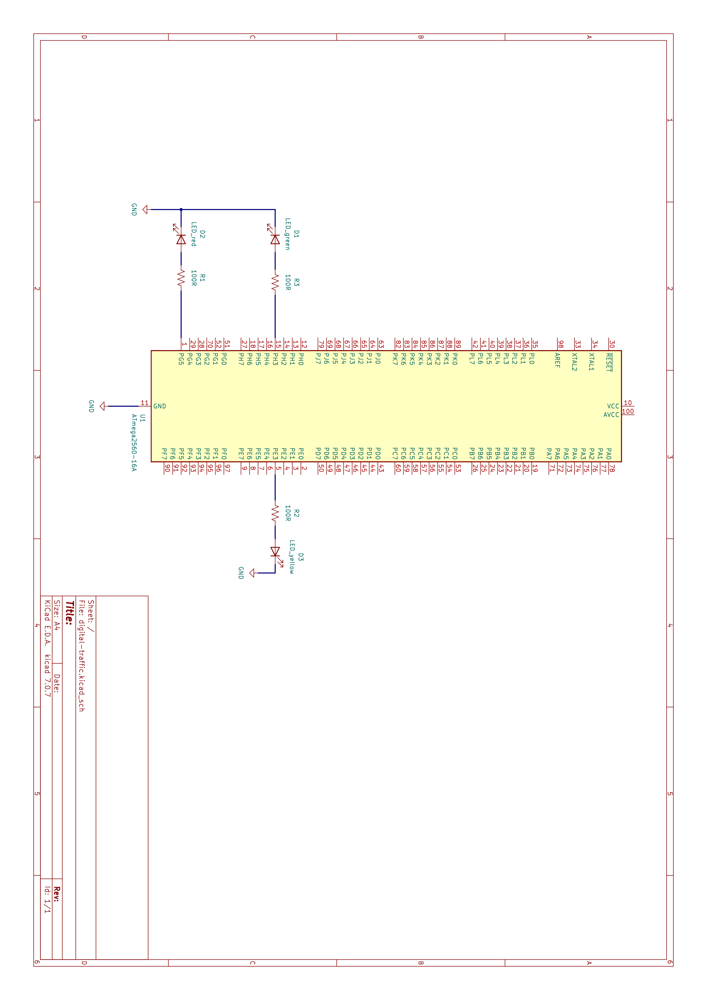
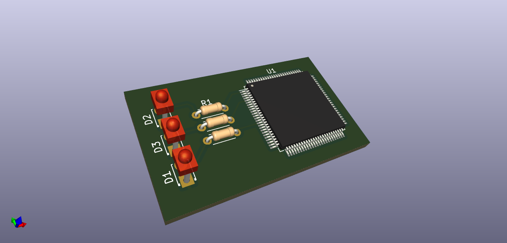
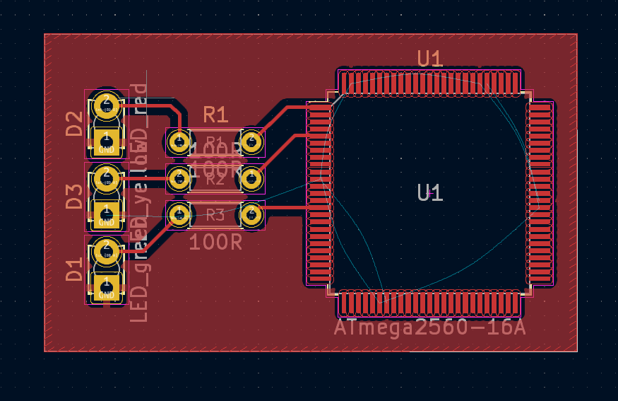

# Construction of a traffic light with digital systems 🚦

The objective of this work was to design a traffic light system in which the closed signal lasts 5s, the attention signal lasts 2s and the open signal lasts 5s. The focus was not only to develop the project, but also to exercise the knowledge acquired regarding the Arduino platform as well as development in C by directly manipulating the registers of the microcontroller used (ATMega2560).

## 📦 Component List

|Name                       |Quantity|Component             |
|---------------------------|--------|----------------------|
|U1                         |1       |Arduino Mega 2560 |
|DL_red                     |1       |Red LED               |
|DL_yellow                  |1       |Yellow LED            |
|RR_green, RR_yellow, RR_red|3       |100 Ω Resistor        |
|DL_green                   |1       |Green LED             |

## 💡 Schematic View

Based on the designed schematic, the circuit was assembled, and a conceptual visualization of the PCB was produced using the KiCad software.

Below, you can observe the results of the 3D PCB project and in the KiCad PCB editor.

## 💻 Simulation

<a scr="./assets/simulation.mp4" align="center">
  <video alt="simulation video" src="./assets/simulation.mp4" 
  controls
  width="200"
  autoplay 
  muted>
  </video>
</a>

---

  Federal University of Rio Grande do Norte - Department of Computer Engineering and Automation.

